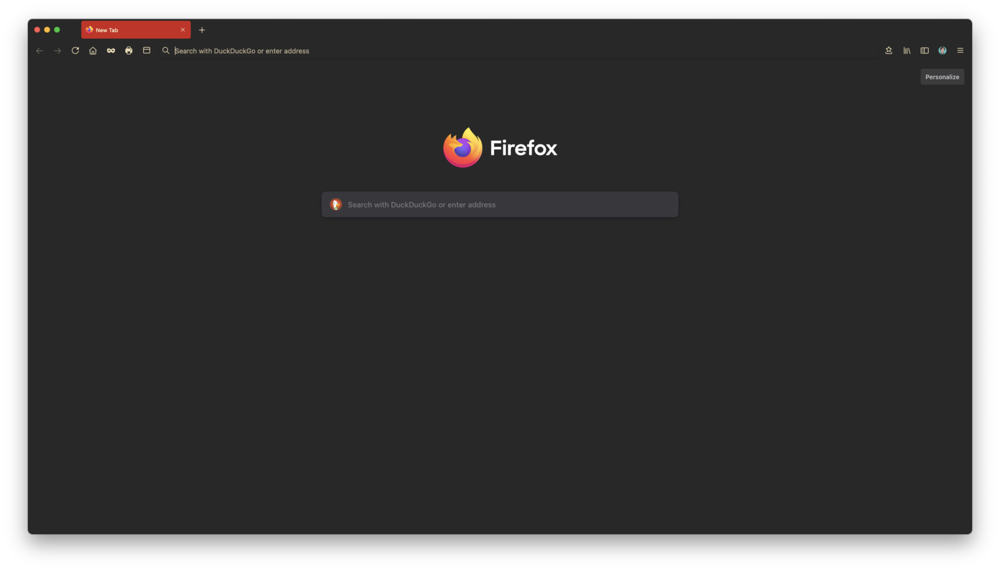

# GruvFox
A minimal GruvBox theme for Firefox

## Theme
This is a Medium Dark Gruvbox theme though I am working on including the hard, medium, and dark flavors of the light and dark varients in the future. The palette I used can be found [here](https://github.com/morhetz/gruvbox).

## How to use 
If you don't want to use the native Firefox extention which can be found [here](https://addons.mozilla.org/en-US/firefox/addon/gruvfox/), you can download the release and sign & upload for personal use. You can also download the source, alter it, and use the makefile to zip it automatically and upload it.

Hope you enjoy.
